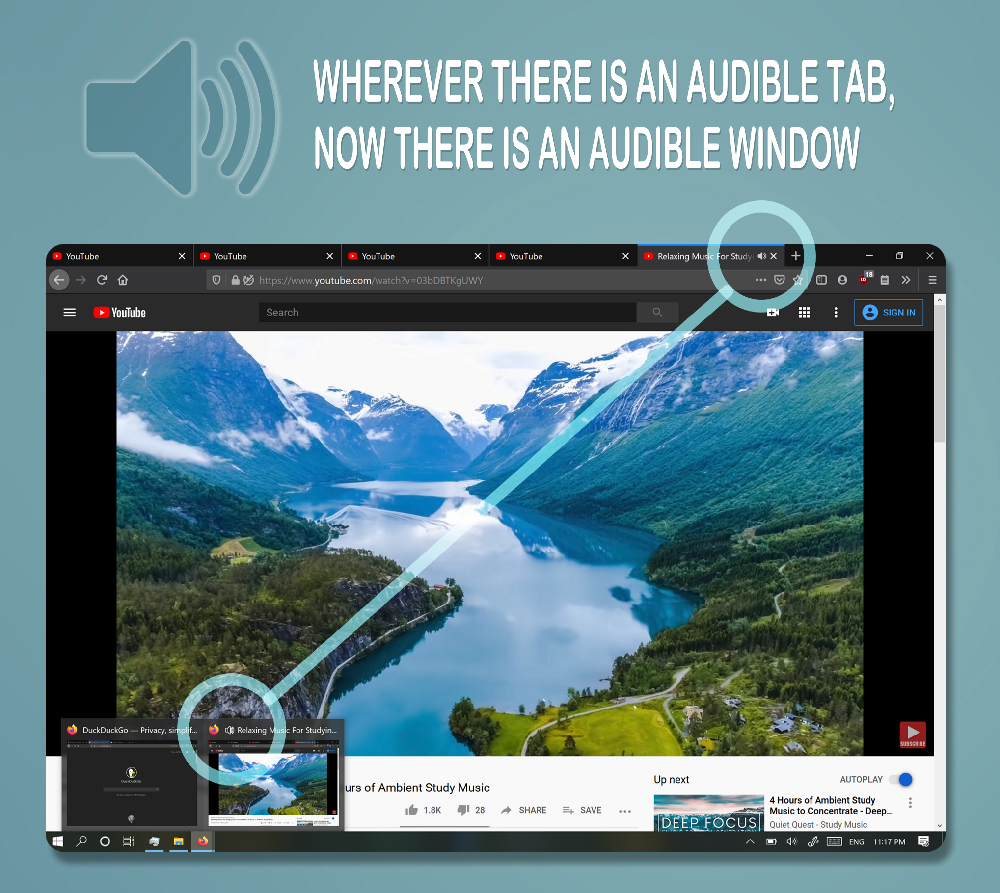

# AudibleWindows

## Motivation

Modern browsers provide utility to let the user know which tabs are currently playing audio. This is useful when you have multiple tabs open where one or more tabs are playing audio but you are currently working on something else. You can find the audible tabs with a quick glance just by looking for the tabs that have a speaker icon on them. BUT, what about having multiple windows at the same time? Especially when the window in question has many tabs that the audible tab is buried out of sight, and you are not sure which window is playing audio.

*[This extension](https://addons.mozilla.org/en-US/firefox/addon/audible-windows/) solves that problem.* 

## Usage 

This extension has no configuration. You just install it, and it runs. Whenever there’s any audible page in any window, you will see a speaker emoji prepended to that window's title. As simple as that.

The extension is available for download at https://addons.mozilla.org/en-US/firefox/addon/audible-windows/

Alternatively, you can download the source code of the latest version from here to try it. To do that, have the files in a single directory and follow the **Installing** section on https://developer.mozilla.org/en-US/docs/Mozilla/Add-ons/WebExtensions/Your_first_WebExtension

## Use Cases

- When you have many windows open, you can with a quick glance find which windows are playing audio by looking for the speaker symbol in the window titles. 

- When you may not have as many windows but you have many tabs on each window, that the audible tabs cannot be readily found, you can quickly look for the window with the speaker in the title.

## Support 
The extension is currently only available on Firefox as the WebExtension API used by the extension to modify the window's title is only supported by Firefox. Once that is available for other browsers, extended support should follow. 

The extension has been tested on Windows, MacOS and few flavors of Linux, but it should work on any operating system where Firefox can run, since the API calls used by this extension are local to Firefox.

## Privacy
This extension does not collect nor send any information whatsoever.
